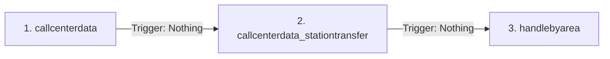

# Nguyên Lý ETL & Kiến Trúc Dữ Liệu Chung

Tài liệu này ghi nhận nguyên lý hoạt động cốt lõi của quy trình **ETL (Extract - Transform - Load)** được thiết kế và vận hành trong dự án `chi-so-chat-luong`. Hệ thống sử dụng **Dagster** làm lớp điều phối (Orchestration) và **Python (Pandas)** làm động cơ xử lý dữ liệu.

---

## 1. Tổng Quan Kiến Trúc Luồng Dữ Liệu

Hệ thống thu thập dữ liệu từ nhiều nguồn khác nhau (Google Drive, Directus, API bên ngoài), thực hiện làm sạch, chuẩn hóa và tổng hợp trước khi lưu trữ vào cơ sở dữ liệu **PostgreSQL** để phục vụ báo cáo.

```mermaid
flowchart TD
    subgraph Nguồn Dữ Liệu (Sources)
        GD_KCCNBV[Google Drive: Excel KCCNBV]
        GD_SuCo[Google Sheets: Báo cáo Giao ban]
        GD_ChiSo[Google Sheets: Chỉ số Chất lượng]
        DIR_KDH[Directus: Call Center & Area Data]
        API_115[API 115: Báo cáo Vệ tinh & Bệnh viện]
    end

    subgraph Lop Dieu Phoi Dagster (Transform)
        A_KCCNBV[kccnbv_data_asset] --> T_KCCNBV[Chuẩn hóa tên cột & Ẩn danh bệnh nhân]
        A_SuCo[suco_data_asset] --> T_SuCo[Map Schema & Bổ sung cột]
        A_ChiSo[chiso_data_asset] --> T_ChiSo[Định danh Trạm & Gộp mới nhất]
        A_KDH[callcenter_and_area_asset] --> T_KDH[Tách danh sách chuyển trạm]
        A_API[raw_api_115_data] --> T_API[Tách trạm vệ tinh & Bệnh viện]
    end

    subgraph Cơ Sở Dữ Liệu PostgreSQL (Load)
        T_KCCNBV --> DB_KCCNBV[(public.kccnbv)]
        T_SuCo --> DB_SuCo[(public.suco)]
        T_ChiSo --> DB_ChiSo[(public.chi_so)]
        
        T_KDH --> DB_C1[(public.callcenterdata)]
        T_KDH --> DB_C2[(public.callcenterdata_stationtransfer)]
        T_KDH --> DB_C3[(public.handlebyarea)]
        
        T_API --> DB_API1[(public.tranfer_satellite)]
        T_API --> DB_API2[(public.receiving_hospital)]
    end

    T_KCCNBV --> H_Sync[hospital_receiving_summary_asset]
    H_Sync --> DB_API2
```

---

## 2. Bản Đồ Các Bảng Dữ Liệu Đích (PostgreSQL)

Mỗi luồng ETL chịu trách nhiệm xử lý và nạp dữ liệu vào một hoặc nhiều bảng cụ thể trong schema `public` của PostgreSQL. Dưới đây là danh sách chi tiết:

| STT | Bảng Đích trong DB | Nguồn Dữ Liệu Gốc | Khóa Chính / Khóa Trùng (Keys) | Ý Nghĩa / Mục Tiêu Nghiệp Vụ |
| :---: | :--- | :--- | :--- | :--- |
| **1** | `public.kccnbv` | Excel trên Google Drive | `so_benh_an` | Lưu thông tin chi tiết từng chuyến xe cấp cứu ngoài bệnh viện (thời gian, địa chỉ, triệu chứng, bệnh viện nhận, xử trí). |
| **2** | `public.suco` | Google Sheets (sheet `suCoYKhoa`) | `Dấu_thời_gian`, `Ngày_báo_cáo` | Lưu trữ báo cáo sự cố y khoa từ các khoa phòng (loại sự cố, mô tả, nguyên nhân, giải pháp tức thì, phân cấp nguy cơ). |
| **3** | `public.chi_so` | Google Sheets (file chỉ số) | `time`, `datereport`, `room` | Lưu các chỉ số chất lượng định kỳ (hiệu suất xe, thời gian hiện trường, tỷ lệ vệ sinh tay, hài lòng người dân...). |
| **4** | `public.callcenterdata` | Directus API (`callCenterData`) | `id` | Lưu dữ liệu tiếp nhận cuộc gọi tổng đài 115 (số điện thoại, thời gian nhận, phân loại cuộc gọi). |
| **5** | `public.callcenterdata_stationtransfer` | Directus API & KCCNBV Excel | `id` hoặc `date` + `id_hospital` | Lưu thông tin chi tiết các ca chuyển trạm cấp cứu vệ tinh hoặc bệnh viện. |
| **6** | `public.handlebyarea` | Directus API (`handleByArea`) | `id` | Lưu dữ liệu điều phối cấp cứu theo khu vực địa bàn. |
| **7** | `public.outofhospitalreport` | Directus API (`OutOfHospitalReport`)| `id` | Báo cáo y khoa cấp cứu ngoài bệnh viện dạng văn bản số hóa. |
| **8** | `public.receiving_hospital` | API 115 & KCCNBV Excel | `date`, `id_hospital` | Bảng tổng hợp số lượng bệnh nhân thực tế chuyển đến từng bệnh viện theo ngày. |
| **9** | `public.tranfer_satellite` | API 115 | `date`, `id_satellite` | Báo cáo số ca chuyển, nhận, từ chối của từng trạm cấp cứu vệ tinh theo ngày. |
| **10** | `public.hospital` | API 115 & Catalog DB | `id` | Danh mục toàn bộ các bệnh viện tham gia hệ thống cấp cứu 115. |

---

## 3. Nguyên Lý Idempotency (Chạy Lặp Lại An Toàn)

> [!IMPORTANT]
> **Idempotency (Tính khả trùng)** là nguyên tắc thiết kế quan trọng nhất của hệ thống ETL này. 
> Một pipeline có tính khả trùng nghĩa là dù chạy đi chạy lại một hay nhiều lần với cùng một tập dữ liệu đầu vào, kết quả lưu trữ trong database vẫn không thay đổi, không tạo ra các bản ghi trùng lặp và không làm sai lệch số liệu báo cáo.

### Cơ chế hoạt động của hàm ghi Database (`insert_dataframe_to_postgres`)

Hệ thống giải quyết tính khả trùng thông qua cơ chế **Upsert (Update if exists, Insert if not)** tại file `dagster_project/utils/insert_postgres.py`:

1. **Ghi đè hoặc nối thêm thông thường (Không có `key_columns`)**:
   - Nếu tham số `key_columns` trống, hệ thống sẽ tiến hành append dữ liệu hoặc ghi đè toàn bộ bảng (tùy thuộc cấu hình `if_exists`). Cách này dễ dẫn đến nhân bản dữ liệu nếu chạy định kỳ.
2. **Upsert thông minh (Có `key_columns`)**:
   - Khi khai báo `key_columns` (ví dụ: `so_benh_an` đối với bảng `kccnbv` hoặc `['time', 'datereport', 'room']` đối với bảng `chi_so`):
     - Hệ thống sẽ tạo một bảng tạm (staging table) chứa dữ liệu mới vừa clean.
     - Sử dụng câu lệnh SQL `INSERT INTO ... ON CONFLICT (key_columns) DO UPDATE SET ...` để đẩy dữ liệu từ bảng tạm vào bảng chính.
     - Nếu khóa chính đã tồn tại, toàn bộ các cột thông tin sẽ được cập nhật mới nhất. Nếu chưa tồn tại, bản ghi mới sẽ được chèn vào.

**Ví dụ câu lệnh SQL Upsert sinh ra tự động:**
```sql
INSERT INTO public.kccnbv (so_benh_an, ho_ten_benh_nhan, ngay, goi_cap_cuu, ...)
VALUES ('26052901', 'NVA', '2026-05-29', '08:30:00', ...)
ON CONFLICT (so_benh_an) 
DO UPDATE SET 
    ho_ten_benh_nhan = EXCLUDED.ho_ten_benh_nhan,
    ngay = EXCLUDED.ngay,
    goi_cap_cuu = EXCLUDED.goi_cap_cuu,
    ...;
```

---

## 4. Tuần Tự Thực Thi & Ràng Buộc Ràng Trực Tiếp (Dependencies)

Để tránh lỗi vi phạm khóa ngoại (Foreign Key Constraints) hoặc ghi dữ liệu không đồng nhất, một số pipeline yêu cầu thứ tự chạy nghiêm ngặt.

### Luồng Dữ Liệu KDH từ Directus

Trong Job `upload_kdh_job`, dữ liệu được ghi vào 3 bảng liên đới theo thứ tự:



- **Nguyên nhân**: Bảng `callcenterdata_stationtransfer` chứa các bản ghi được phân tách từ thuộc tính mảng của `callcenterdata`. Do đó, bản ghi cha tại `callcenterdata` phải được ghi trước để đảm bảo tính toàn vẹn dữ liệu.
- **Giải pháp Dagster**: Các Op ghi DB kế sau nhận tham số đầu vào `trigger: In(Nothing)` liên kết với kết quả đầu ra của Op ghi DB trước đó. Điều này ép Dagster phải chạy tuần tự dù các tác vụ ghi độc lập về mặt luồng Pandas DataFrame.
