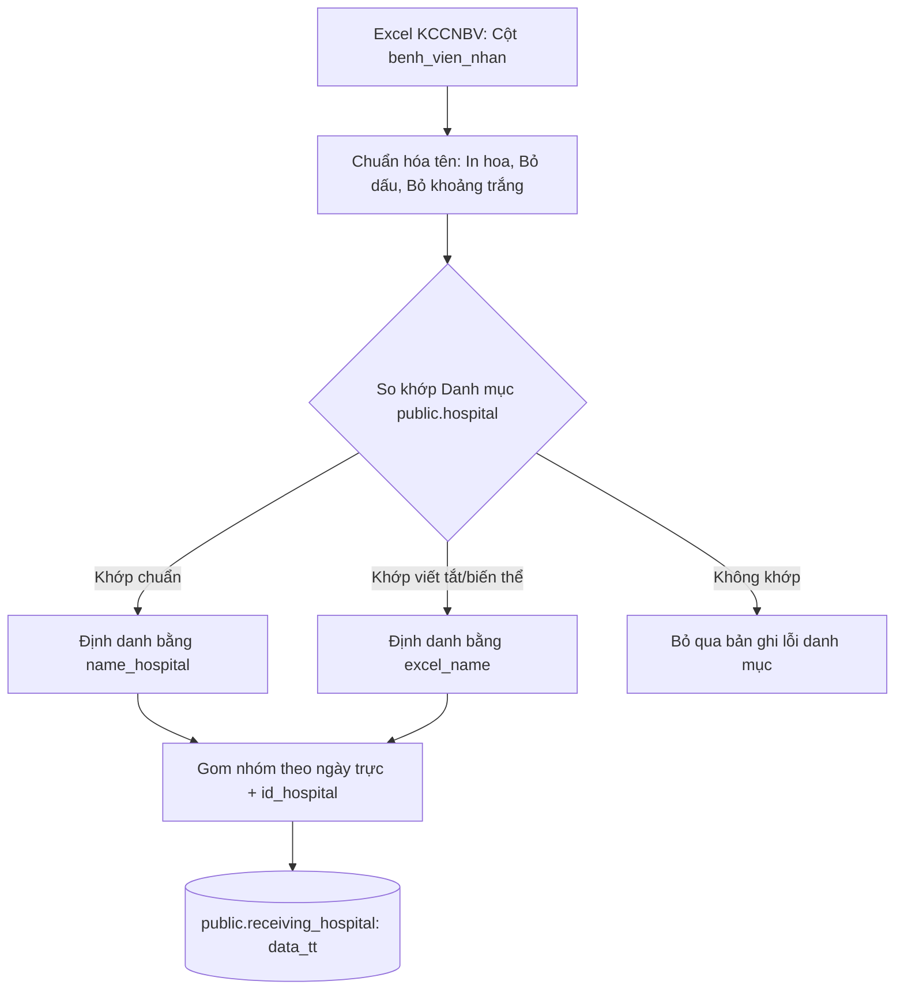

# Các Công Thức & Nguyên Tắc Tính Toán Nghiệp Vụ

Tài liệu này ghi nhận toàn bộ các công thức toán học, logic điều hướng và nguyên tắc tính toán nghiệp vụ được áp dụng trong quá trình biến đổi (Transform) dữ liệu của dự án. Đây là những quy tắc cốt lõi giúp chuyển hóa dữ liệu thô thành thông tin phân tích chất lượng cao.

---

## 1. Công Thức Chuyển Đổi Ngày Trực (Shift Date)

> [!NOTE]
> **Bài toán nghiệp vụ**: Ca trực cấp cứu của Trung tâm 115 hoạt động liên tục 24h, bắt đầu từ **06:30 sáng hôm trước** và kết thúc lúc **06:30 sáng hôm sau**.
> Nếu một ca cấp cứu diễn ra lúc **02:00 AM ngày 29/05/2026**, về mặt lịch thông thường nó thuộc ngày 29/05. Nhưng về mặt nghiệp vụ y khoa và ca kíp trực, nó thuộc ca trực của ngày **28/05/2026**.

Hệ thống giải quyết bài toán này bằng hàm `get_shift_date` trong file `hospital_sync_logic_data_tt.py`.

### Công thức Toán học:
Gọi $T$ là thời điểm cuộc gọi cấp cứu (`goi_cap_cuu`) và $D$ là ngày lịch tiếp nhận cuộc gọi (`ngay`). Ngày trực thực tế ($D_{\text{shift}}$) được tính theo công thức:

$$D_{\text{shift}} = \begin{cases} D - 1 \text{ ngày} & \text{nếu } T < 06:30 \\ D & \text{nếu } T \ge 06:30 \end{cases}$$

### Thuật toán thực thi trong mã nguồn:
1. Trích xuất giờ và phút từ cột thời điểm cuộc gọi (`goi_cap_cuu`), hỗ trợ các định dạng `HH:MM:SS`, `HH:MM` hoặc đối tượng thời gian Python.
2. Kết hợp với ngày tiếp nhận để tạo thành mốc thời gian đầy đủ (`datetime`).
3. So sánh phần giờ với mốc `06:30:00`. Nếu nhỏ hơn, thực hiện trừ đi `timedelta(days=1)`.
4. Trả về kết quả dưới dạng đối tượng `date` chuẩn hóa để ghi nhận vào cột `date` của bảng tổng hợp.

---

## 2. Nguyên Tắc Tính Toán Chỉ Số Chất Lượng (Quality Indicators)

Báo cáo chỉ số chất lượng được nạp từ Google Sheets thông qua `chiso_data_asset` và xử lý tại `chiso_processing.py`. Quy trình này bao gồm 3 nguyên tắc nghiệp vụ cực kỳ quan trọng:

### A. Ánh Xạ Mã Trạm Vệ Tinh (`ROOM_ID_MAP`)
Báo cáo nhập từ các khoa phòng gửi lên dưới dạng tên chuỗi dài. Hệ thống tự động ánh xạ tên khoa/phòng sang ID trạm vệ tinh tương ứng trong database:

| Tên Khoa/Phòng Nhập Báo Cáo | ID Trạm Vệ Tinh (`id`) | Tên Trạm Quy Chuẩn |
| :--- | :---: | :--- |
| `Khoa Cấp cứu ngoài bệnh viện` | **1** | Trạm Trung tâm 115 |
| `Khoa Cấp cứu ngoài bệnh viện (Trạm vệ tinh đường thủy Cần Giờ)` | **2** | Trạm Cần Giờ |
| `Khoa Cấp cứu ngoài viện ( Trạm cấp cứu vệ tinh 115 tại Trung tâm Y tế Quận 8)` | **3** | Trạm Quận 8 |
| `Khoa Cấp cứu ngoài viện ( Trạm cấp cứu vệ tinh 115 tại Bệnh viện Ung Bướu - Cơ sở 2)` | **4** | Trạm Ung Bướu |
| `Khoa Cấp cứu ngoài viện ( Trạm cấp cứu vệ tinh 115 tại Bệnh viện Thủ Đức)` | **41** | Trạm Thủ Đức |
| `Khoa Cấp cứu ngoài viện ( Trạm cấp cứu vệ tinh 115 Bình Trưng tại Bệnh viện Lê Văn Thịnh)` | **43** | Trạm Bình Trưng |

---

### B. Quy Tắc Phân Nhóm Tài Chính Đặc Biệt (Phòng Kế hoạch - Tài chính)
> [!IMPORTANT]
> **Trường hợp ngoại lệ**: Khi người dùng thuộc `"Phòng Kế hoạch - Tài chính"` báo cáo số liệu, họ nhập số lượng biên lai và doanh thu thu tiền của **nhiều trạm vệ tinh trên cùng một dòng**.
>
> Hệ thống sẽ không gán mặc định ID trạm bằng 1, mà thực hiện phân rã dòng đó thành các bản ghi của từng trạm riêng biệt dựa trên các nhóm cột chỉ số tài chính có dữ liệu phi rỗng.

Quy tắc ghi đè ID trạm cho Phòng Kế hoạch - Tài chính được thực thi qua hàm `add_id_by_room`:

- **Nhóm 1 $\rightarrow$ Trạm Trung tâm (ID = 1)**: Nếu có dữ liệu ở một trong các cột chỉ số doanh thu chung không hậu tố (`cs51`, `cs52`, `cs53`).
- **Nhóm 2 $\rightarrow$ Trạm Cần Giờ (ID = 2)**: Nếu có dữ liệu ở một trong các cột chỉ số có hậu tố Cần Giờ (`cs51cg`, `cs52cg`, `cs53cg`).
- **Nhóm 3 $\rightarrow$ Trạm Quận 8 (ID = 3)**: Nếu có dữ liệu ở một trong các cột chỉ số có hậu tố Quận 8 (`cs51q8`, `cs52q8`, `cs53q8`).
- **Nhóm 4 $\rightarrow$ Trạm Ung Bướu (ID = 4)**: Nếu có dữ liệu ở một trong các cột chỉ số có hậu tố Ung Bướu (`cs51ub`, `cs52ub`, `cs53ub`).
- **Nhóm 5 $\rightarrow$ Trạm Thủ Đức (ID = 41)**: Nếu có dữ liệu ở một trong các cột chỉ số có hậu tố Thủ Đức (`cs51td`, `cs52td`, `cs53td`).
- **Nhóm 6 $\rightarrow$ Trạm Bình Trưng (ID = 43)**: Nếu có dữ liệu ở một trong các cột chỉ số có hậu tố Bình Trưng (`cs51bt`, `cs52bt`, `cs53bt`).

---

### C. Thuật Toán Lấy Chỉ Số Mới Nhất (`aggregate_latest_by_report_station`)
Trong cùng một ngày báo cáo (`datereport`), một trạm vệ tinh có thể gửi báo cáo nhiều lần do nhập sửa đổi hoặc bổ sung. Nếu chỉ đơn giản lấy bản ghi cuối cùng, có thể bị mất dữ liệu của các chỉ số đã nhập ở bản ghi trước nhưng để trống ở bản ghi sau.

Hệ thống xử lý bằng cơ chế **"Hội tụ và lấy giá trị phi rỗng mới nhất"**:

1. Gom nhóm toàn bộ dữ liệu chỉ số theo Cặp khóa: `datereport` + `id` (Trạm).
2. Sắp xếp các bản ghi trong nhóm tăng dần theo `time` (Dấu thời gian gửi - dòng cũ ở trên, dòng mới ở dưới).
3. Với mỗi cột chỉ số (từ `cs24` đến `cs53`):
   - Duyệt ngược danh sách từ dưới lên (từ bản ghi mới nhất trở về bản ghi cũ hơn).
   - Lấy giá trị đầu tiên phát hiện được có chứa dữ liệu (không phải `NaN`, `Null` hoặc chuỗi rỗng).
   - Gán giá trị đó cho cột chỉ số của ngày hôm đó.
4. Trả về DataFrame hội tụ chứa duy nhất 1 dòng đại diện cho mỗi cặp ngày và trạm, tích hợp đầy đủ mọi chỉ số được cập nhật mới nhất.

---

## 3. Logic So Khớp & Đồng Bộ Bệnh Viện Nhận Bệnh (Hospital Sync)

Bảng `public.receiving_hospital` lưu trữ số liệu so sánh giữa dữ liệu báo cáo từ API 115 và dữ liệu thực tế nhập từ Excel. Logic so khớp thông minh này được thực thi tại `hospital_sync_logic_data_tt.py`:

### Quy trình chi tiết:
1. **Lọc trạm hợp lệ**: Hệ thống chỉ lấy các chuyến cấp cứu được thực hiện bởi 5 trạm vệ tinh nòng cốt:
   - `TVT TRẠM TRUNG TÂM 115`
   - `TVT TTYT KHU VỰC BÌNH ĐÔNG (TRUNG TÂM Y TẾ QUẬN 8)`
   - `TVT Trung tâm cấp cứu 115 - Cần Giờ`
   - `TVT BV UNG BƯỚU CS2`
   - `TVT  TTCC115 Thủ Đức`
2. **Khớp mã bệnh viện thông minh**:
   - Chuyển đổi toàn bộ cột tên bệnh viện nhận trong Excel (`benh_vien_nhan`) thành chữ in hoa và loại bỏ khoảng trắng thừa.
   - Tạo hai từ điển ánh xạ từ danh mục `public.hospital` đã tải sẵn từ DB:
     - Từ điển 1: `name_hospital` (tên chuẩn database) $\rightarrow$ `id` (mã bệnh viện).
     - Từ điển 2: `excel_name` (các biến thể viết tắt thường dùng trong Excel) $\rightarrow$ `id`.
   - Kết hợp hai từ điển này (ưu tiên tên biến thể Excel để ghi đè) để dò tìm mã `id_hospital` phù hợp nhất cho chuỗi Excel thô.
3. **Tổng hợp số ca thực tế (`data_tt`)**:
   - Sau khi khớp thành công mã bệnh viện và tính toán Ngày trực (`report_date`), hệ thống tiến hành gom nhóm theo `[date, id_hospital]`.
   - Thực hiện đếm tần suất số lượng dòng cấp cứu thành công của từng nhóm để tính ra tổng số ca thực tế chuyển viện (`data_tt`).
   - Lưu trữ/Upsert kết quả vào bảng `public.receiving_hospital`.

---

## 4. Tích Hợp Số Liệu Hệ Thống Cấp Cứu Thông Minh API 115

Dữ liệu API 115 được đồng bộ tự động hàng ngày cho 5 ngày gần nhất qua `api_115_asset.py`:

- **Trạm Vệ Tinh (`public.tranfer_satellite`)**:
  - API trả về danh sách cuộc gọi theo ngày và trạm.
  - Trích xuất số lượng cuộc gọi được **chấp nhận** (`accepted` $\rightarrow$ ghi vào cột `accept`) và số lượng bị **từ chối** (`rejected` $\rightarrow$ ghi vào cột `deny`).
  - Ghi nhận và đối chiếu hoạt động của trạm điều hành cấp cứu vệ tinh theo ngày.
- **Bệnh Viện Tiếp Nhận (`public.receiving_hospital`)**:
  - API trả về tổng số ca cấp cứu điều phối thông qua hệ thống thông minh chuyển đến từng bệnh viện (`totalReceived` $\rightarrow$ ghi vào cột `data_tvt`).
  - Dữ liệu này được đối chiếu trực tiếp với cột dữ liệu thực tế (`data_tt`) tổng hợp từ Excel ở phần 3 để giám sát độ chính xác giữa điều phối hệ thống và báo cáo thực tế.
- **Đồng bộ Danh mục tự động**:
  - Nhằm tránh lỗi hệ thống khi API 115 phát sinh mã bệnh viện mới chưa từng xuất hiện trong danh mục PostgreSQL.
  - Hàm `extract_unique_hospitals_metadata` sẽ duyệt toàn bộ kết quả API, tự động trích xuất các mã hospital mới chưa tồn tại trong `public.hospital` và thực hiện chèn đồng bộ vào bảng danh mục master trước khi tiến hành ghi các báo cáo chi tiết.
