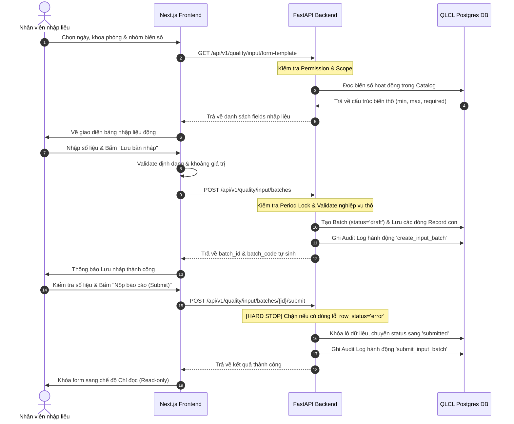

# Hướng Dẫn Tích Hợp & Vận Hành Phân Hệ QLCL Web (Phase 2 & Phase 3)

Tài liệu này tổng hợp toàn bộ cấu trúc kiến trúc, mô hình phân quyền, quy tắc nghiệp vụ nhập liệu thủ công và hướng dẫn vận hành cho **Phase 2 (Core Data & RBAC)** và **Phase 3 (Manual Web Input MVP)** thuộc dự án QLCL Web.

---

## 1. Tổng Quan Kiến Trúc & Tách Biệt CSDL (Phase 2)

Hệ thống được thiết kế theo mô hình **Tách biệt CSDL (Storage Partitioning)** để đảm bảo an toàn thông tin nghiệp vụ lâm sàng:
- **AgentAI / RAG CSDL (Local):** Sử dụng các biến môi trường `POSTGRES_*` kết nối tới container local phục vụ tính năng AI Chatbot và lưu trữ tài liệu RAG.
- **QLCL Web CSDL (Authoritative):** Sử dụng các biến môi trường `QUALITY_POSTGRES_*` kết nối tới CSDL bên ngoài (`172.16.20.17`). Toàn bộ các bảng nghiệp vụ lâm sàng chất lượng bắt đầu bằng tiền tố `quality_*` bắt buộc chỉ nằm trên database này.

### Danh Sách Các Bảng Nghiệp Vụ `quality_*` Lõi:
1. **`quality_departments`:** Danh mục khoa phòng bệnh viện (BGD, KDH, KCCNBV, QLCL...).
2. **`quality_stations`:** Danh mục trạm vệ tinh lâm sàng.
3. **`quality_hospitals`:** Danh mục các bệnh viện liên kết.
4. **`quality_indicator_catalog`:** Từ điển danh mục các chỉ số chất lượng lâm sàng (CS1 - CS10).
5. **`quality_indicator_variables`:** Định nghĩa các biến số thô dùng để nhập liệu (Biến nhóm A, Biến nhóm B).
6. **`quality_indicator_thresholds`:** Ngưỡng cảnh báo chỉ số chất lượng (cảnh báo min/max, mục tiêu).
7. **`quality_roles` / `quality_permissions` / `quality_role_permissions`:** Phân quyền vai trò nghiệp vụ chất lượng.
8. **`quality_user_roles` / `quality_user_scopes`:** Ánh xạ vai trò người dùng và phạm vi dữ liệu khoa/trạm được phép thao tác.
9. **`quality_audit_logs`:** Nhật ký giám sát bảo mật hệ thống (Ghi nhận toàn bộ hành động tạo/sửa/nộp báo cáo).
10. **`quality_input_batches`:** Quản lý đợt/lô báo cáo số liệu của từng khoa phòng theo ngày/tháng.
11. **`quality_input_records`:** Lưu trữ chi tiết giá trị số liệu thô cho từng biến số lâm sàng được điền trong form.

---

## 2. Hệ Thống Phân Quyền & Bảo Vệ Phạm Vi Dữ Liệu (RBAC & Scopes)

Cơ chế phân quyền được tổ chức chặt chẽ từ Backend đến Frontend để đảm bảo nhân viên chỉ được thao tác trên dữ liệu được phân công:

### Các Vai Trò Nghiệp Vụ Chính (Roles):
- **`system_admin` / `quality_admin`:** Quản trị viên hệ thống. Có toàn quyền xem, sửa, phê duyệt và đặc cách bỏ qua mọi kiểm tra phạm vi dữ liệu (Scope Bypass) để giám sát toàn bệnh viện.
- **`department_manager`:** Trưởng khoa / Người phê duyệt. Được quyền xem dashboard, phê duyệt hoặc từ chối báo cáo số liệu trong khoa phòng quản lý.
- **`data_entry`:** Nhân viên nhập liệu. Có quyền lập báo cáo nháp, sửa nháp và nộp báo cáo đi duyệt trong phạm vi khoa phòng được gán.

### Cơ Chế Bảo Vệ 3 Lớp Trên API:
Mỗi khi có yêu cầu gọi tới API báo cáo, Backend thực thi tuần tự 3 bộ kiểm tra bảo mật (nằm trong file [rbac.py](file:///home/sonnguyen/CSCL_Web/CSCL_Web/apps/agent-ai/backend/rbac.py)):

1. **`require_permission(user, permission_code)` (Kiểm tra Quyền):**
   Xác minh người dùng có mã quyền thực thi chức năng đó không (Ví dụ: quyền nhập liệu `reports:input:create`, quyền xem `reports:input:view`, quyền nộp `reports:input:submit`). Chặn 403 Forbidden nếu không có quyền.
   
2. **`require_scope(user, scope_type, scope_code)` (Kiểm tra Khoa/Trạm):**
   Xác thực xem cặp phạm vi dữ liệu của khoa phòng thao tác có nằm trong danh sách gán của user trong `quality_user_scopes` không. (Quản trị viên được bypass bước này).
   
3. **`require_period_not_locked(report_date, department_code...)` (Kiểm tra Kỳ Khóa Sổ):**
   Truy vấn bảng `quality_period_locks`. Nếu ngày báo cáo và khoa tương ứng đã bị khóa sổ kỳ kế toán/báo cáo, Backend sẽ thực hiện **Hard Stop (Chặn đứng)** mọi hành vi sửa đổi bằng mã lỗi `409 Conflict`.

---

## 3. Quy Trình Nhập Liệu Nghiệp Vụ Thủ Công (Phase 3 Manual Input MVP)

Quy trình nhập liệu thủ công diễn ra khép kín qua 3 bước chính tương tác giữa Next.js Frontend và FastAPI Backend:



### Các Quy Tắc Validate Lỗi Nghiệp Vụ (Data Quality & Validation):
- **Cận Trên / Cận Dưới (Bounds Check):** Giá trị số nhập vào biến số phải $\ge$ `min_value` và $\le$ `max_value` được quy định trong từ điển. Nếu vi phạm, dòng số liệu sẽ bị đánh dấu `row_status = 'error'` kèm mã lỗi `OUT_OF_BOUNDS_MIN` / `OUT_OF_BOUNDS_MAX`.
- **Trường Bắt Buộc (Required Check):** Nếu biến số được đánh dấu `required = True` nhưng bị bỏ trống, hệ thống đánh dấu lỗi `REQUIRED_FIELD_MISSING`.
- **Cơ Chế Hard Stop Chặn Nộp:** Người dùng có thể lưu nháp một lô dữ liệu chứa lỗi biên để làm việc tiếp, nhưng hệ thống sẽ **chặn đứng hoàn toàn không cho phép Nộp báo cáo (Submit)** nếu trong lô đó còn tồn tại dù chỉ một dòng chứa trạng thái lỗi `error`. Người dùng phải sửa sạch lỗi mới có thể gửi nộp.

---

## 4. Ghi Chú Đọc Hiểu Code (Developer Onboarding)

Các đoạn code quan trọng đã được viết thêm nhận xét và giải thích chi tiết bằng tiếng Việt để hỗ trợ lập trình viên đọc hiểu trực quan:

1. **[FastAPI main.py: L350-850](file:///home/sonnguyen/CSCL_Web/CSCL_Web/apps/agent-ai/backend/main.py#L350-L850):** 
   Chứa toàn bộ luồng xử lý API Phase 3 (`form-template`, tạo/sửa/chi tiết/nộp lô báo cáo). Các chú thích giải thích chi tiết cấu trúc Pydantic Schema, thuật toán sinh mã lô tuần tự duy nhất dạng `INP-YYYYMMDD-XXXX`, và cơ chế validate hard stop trước khi commit DB.
   
2. **[FastAPI rbac.py](file:///home/sonnguyen/CSCL_Web/CSCL_Web/apps/agent-ai/backend/rbac.py):**
   Giải thích rõ cơ chế ánh xạ quyền tương thích ngược giữa các vai trò cũ và mới, luồng kiểm tra scope an toàn, và logic đối chiếu bảng khóa sổ kỳ báo cáo `quality_period_locks`.
   
3. **[SQLAlchemy models.py: L360-422](file:///home/sonnguyen/CSCL_Web/CSCL_Web/apps/agent-ai/backend/models.py#L360-L422):**
   Mô tả chi tiết ý nghĩa các trường cơ sở dữ liệu của `QualityInputBatch` và `QualityInputRecord`, giải thích tham số `cascade="all, delete-orphan"` đảm bảo tính toàn vẹn dữ liệu (xóa cha tự động xóa con).
   
4. **[Next.js page.tsx](file:///home/sonnguyen/CSCL_Web/CSCL_Web/apps/agent-ai/frontend/app/reports/input/page.tsx):**
   Nhận xét chi tiết cấu trúc State quản lý biểu mẫu, luồng xử lý hook bất đồng bộ tải master/template/lô cũ, logic validate nhanh ở giao diện (inline validation), và cơ chế chuyển đổi trạng thái giao diện sang chế độ Chỉ đọc (Read-only) khi lô báo cáo chuyển sang trạng thái đã nộp (`submitted`, `approved`, `locked`).

---

## 5. Hướng Dẫn Chạy & Kiểm Thử Nghiệm Thu (Verification Guide)

### Bước 1: Khởi chạy CSDL Postgres và các dịch vụ QLCL Web
Di chuyển vào thư mục ứng dụng và khởi chạy Docker Compose:
```bash
cd apps/agent-ai
# Khởi chạy độc lập CSDL trước để sẵn sàng kết nối
docker compose up -d postgres
```

### Bước 2: Chạy Seeding khởi tạo danh mục nghiệp vụ lõi (Phase 2)
Sau khi database đã sẵn sàng, chạy script seeding để tạo bảng chất lượng lâm sàng và nạp danh mục mẫu:
```bash
# Thực thi trực tiếp file python seeding bên trong container backend
docker exec -it ai_chatbot_backend python3 scripts/seed_quality_rbac.py
```
*Script seeding được thiết kế Idempotent (chạy lại nhiều lần không lỗi, không ghi trùng lặp dữ liệu).*

### Bước 3: Kiểm thử thủ công trên Giao diện Web (Phase 3)
1. Đăng nhập vào hệ thống dưới tài khoản có vai trò nhập liệu (`data_entry`) hoặc quản trị viên.
2. Truy cập phân hệ Nhập báo cáo nghiệp vụ: `/reports/input`.
3. Chọn Ngày báo cáo, Khoa phòng (Ví dụ: `QLCL`) và kỳ báo cáo. Hệ thống sẽ tự động gửi request lấy biểu mẫu và vẽ bảng nhập liệu.
4. **Kiểm tra tính năng Lưu nháp (Save Draft):**
   - Nhập các giá trị thô hợp lệ cho biến nhóm A (A1 - A5) và biến nhóm B (B1 - B5).
   - Nhấn **Lưu bản nháp**. Hệ thống sẽ phản hồi thành công và hiển thị mã lô vừa sinh (Ví dụ: `INP-20260528-0001`) kèm Badge trạng thái màu vàng **Bản nháp**.
5. **Kiểm tra tính năng Validate & Chặn lỗi (Error Validation):**
   - Nhập một giá trị âm (Ví dụ: `-5`) vào trường A1 (Trường A quy định ngưỡng `min_value = 0`).
   - Giao diện Next.js sẽ báo lỗi đỏ ngay lập tức: *Giá trị tối thiểu cho phép là 0*.
   - Cố tình bấm **Nộp báo cáo (Submit)**: Hệ thống sẽ chặn lại ngay ở client và hiển thị toast cảnh báo.
   - Nếu cố tình vượt rào client để gửi request API nộp báo cáo: Backend FastAPI sẽ kích hoạt Hard Stop và trả lỗi `400 Bad Request` chặn đứng hành động ghi.
6. **Kiểm tra tính năng Nộp báo cáo thành công (Submit):**
   - Nhập lại giá trị hợp lệ lớn hơn hoặc bằng 0 cho toàn bộ các ô nhập liệu.
   - Nhấn **Lưu bản nháp** để cập nhật trạng thái sạch lỗi.
   - Nhấn **Nộp báo cáo**. Hệ thống sẽ khóa lô dữ liệu thành công, hiển thị Badge màu xanh **Đã gửi duyệt**, và toàn bộ biểu mẫu sẽ tự động chuyển sang trạng thái Chỉ đọc (không cho sửa đổi dữ liệu nữa).
7. **Kiểm tra Audit Log:** Truy cập bảng `quality_audit_logs` để kiểm tra các dòng ghi nhận tự động dạng `'create_input_batch'` và `'submit_input_batch'` tương ứng với tài khoản vừa thao tác.
