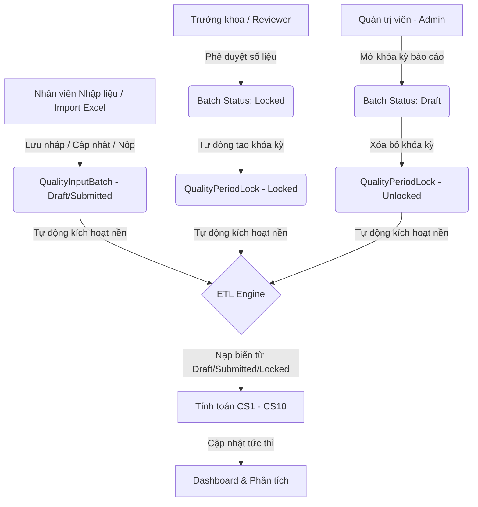

# Tài Liệu Tích Hợp - Phase 6: Động Cơ Tính Toán Tự Động Thời Gian Thực & Khóa Sổ Thông Minh

Tài liệu này ghi nhận chi tiết về kiến trúc cải tiến của động cơ tính toán chỉ số chất lượng lâm sàng bằng Python (ETL Engine), cơ chế **kích hoạt tự động thời gian thực (Real-time Auto-Calculation)**, quy trình **Duyệt tự động Khóa sổ (Approval Auto-Lock)** và **Mở khóa hoàn nháp (Unlock to Draft)** được triển khai trong **Phase 6**.

---

## 1. Kiến Trúc Cải Tiến Thời Gian Thực (Real-Time Architecture)

Để tối ưu hóa trải nghiệm người dùng và đảm bảo tính tức thì của số liệu, chúng tôi đã loại bỏ quy trình kích hoạt tính toán thủ công và thay thế bằng **Kiến trúc Phản ứng Tự động (Reactive Architecture)**:

---

## 2. Vị Trí Các File Đã Cải Tiến & Các Chú Thích (Code Annotations)

Để bạn dễ dàng rà soát, đọc hiểu và chỉnh sửa các công thức tính toán chỉ số, chúng tôi đã gán **chú thích chi tiết bằng tiếng Việt** trực tiếp vào các file mã nguồn sau:

1. **Bộ Tải Biến Thô Đa Trạng Thái:** [backend/data_engine/calculations/variables.py](file:///home/sonnguyen/CSCL_Web/CSCL_Web/apps/agent-ai/backend/data_engine/calculations/variables.py)
   - *Cải tiến:* Hàm `load_input_variables` nạp số liệu từ toàn bộ các trạng thái hoạt động: `["draft", "submitted", "approved", "locked"]`, loại trừ các lô bị từ chối `rejected`.
2. **Đăng ký Tính toán Nền Tự động trên Next.js Backend:** [frontend/app/api/v1/...](file:///home/sonnguyen/CSCL_Web/CSCL_Web/apps/agent-ai/frontend/app/api/v1/)
   - *Cơ chế:* Toàn bộ các API CRUD nghiệp vụ nhập liệu, duyệt báo cáo, khóa sổ và mở khóa kỳ báo cáo đã được di chuyển hoàn toàn từ Python FastAPI sang Next.js API Routes.
   - *Tích hợp & Liên kết:*
     - **Tạo nháp & Lấy danh sách:** `POST/GET /api/v1/quality/input/batches` (Next.js).
     - **Cập nhật & Lấy chi tiết:** `PUT/GET /api/v1/quality/input/batches/[batch_id]` (Next.js).
     - **Nộp báo cáo:** `POST /api/v1/quality/input/batches/[batch_id]/submit` (Next.js).
     - **Phê duyệt tự động Khóa sổ:** `POST /api/v1/quality/input/batches/[batch_id]/approve` (Next.js). Khi phê duyệt, Next.js cập nhật trực tiếp lô sang `'locked'`, chèn bản ghi khóa sổ `quality_period_locks` và tự động cập nhật `quality_review_tasks`.
     - **Mở khóa hoàn nháp kỳ:** `POST /api/v1/quality/period-locks/[lock_id]/unlock` (Next.js). Khi mở khóa kỳ hạn báo cáo, Next.js cập nhật trạng thái mở khóa và tự phục hồi tất cả các lô con tương ứng ngược về trạng thái `'draft'`.
     - **Kích hoạt tính toán nền:** Sau khi xử lý xong nghiệp vụ CSDL, Next.js gọi ngầm REST API nội bộ `POST http://backend:8000/api/v1/quality/calculate/run` của Python microservice truyền kèm `"run_type": "auto"` để chạy tính toán ETL bất đồng bộ.
5. **Giao Diện Nhật Ký ETL:** [frontend/app/etl/calculation-runs/page.tsx](file:///home/sonnguyen/CSCL_Web/CSCL_Web/apps/agent-ai/frontend/app/etl/calculation-runs/page.tsx)
   - *Cải tiến:* Ẩn hoàn toàn form kích hoạt thủ công. Thiết kế giao diện toàn màn hình (Full Width) theo dõi nhật ký hoạt động tính toán tự động và logs gỡ lỗi chi tiết của động cơ Python.
6. **Giao Diện Mở Khóa Sổ:** [frontend/app/reports/locked-periods/page.tsx](file:///home/sonnguyen/CSCL_Web/CSCL_Web/apps/agent-ai/frontend/app/reports/locked-periods/page.tsx)
   - *Cải tiến:* Ẩn form thiết lập khóa tay. Chuyển đổi hoàn toàn thành **Trang quản trị mở khóa kỳ hạn (Unlock Manager)** hiển thị các kỳ báo cáo đã bị khóa tự động và nút mở khóa hồi nháp kèm Modal bắt buộc lý do bảo mật.

---

## 3. Công Thức Tính Toán 10 Chỉ Số MVP (CS1 - CS10)

Động cơ sử dụng các biến thô thuộc nhóm `A` (`A1 - A5`) và nhóm `B` (`B1 - B5`) để tính toán:

| Mã Chỉ Số | Tên Chỉ Số Chất Lượng | Công Thức Tính Toán Chi Tiết | Đơn Vị Tính |
| :--- | :--- | :--- | :--- |
| **CS1** | Tổng số cuộc gọi | `value = Tổng A1` | Cuộc gọi |
| **CS2** | Tỷ lệ cuộc gọi được tiếp nhận | `numerator = Tổng A2`, `denominator = Tổng A1`, `value = (A2 / A1) * 100` | Tỷ lệ (%) |
| **CS3** | Tỷ lệ cuộc gọi có nội dung | `numerator = Tổng A3`, `denominator = Tổng A1`, `value = (A3 / A1) * 100` | Tỷ lệ (%) |
| **CS4** | Tỷ lệ cuộc gọi có dấu hiệu cấp cứu | `numerator = Tổng A4`, `denominator = Tổng A1`, `value = (A4 / A1) * 100` | Tỷ lệ (%) |
| **CS5** | Tỷ lệ cấp cứu điều phối KCCNBV | `numerator = Tổng A5`, `denominator = Tổng A4`, `value = (A5 / A4) * 100` | Tỷ lệ (%) |
| **CS6** | Tổng số ca vận chuyển | `value = Tổng B1` | Ca vận chuyển |
| **CS7** | Tỷ lệ vận chuyển có bệnh nhân cấp cứu | `numerator = Tổng B2`, `denominator = Tổng B1`, `value = (B2 / B1) * 100` | Tỷ lệ (%) |
| **CS8** | Tỷ lệ vận chuyển có can thiệp nâng cao | `numerator = Tổng B3`, `denominator = Tổng B1`, `value = (B3 / B1) * 100` | Tỷ lệ (%) |
| **CS9** | Tỷ lệ vận chuyển chuyển tuyến | `numerator = Tổng B4`, `denominator = Tổng B1`, `value = (B4 / B1) * 100` | Tỷ lệ (%) |
| **CS10** | Tỷ lệ vận chuyển phản hồi trễ | `numerator = Tổng B5`, `denominator = Tổng B4`, `value = (B5 / B4) * 100` | Tỷ lệ (%) |

---

## 4. Hướng Dẫn Vận Hành & Rà Soát Trên Web Portal

1. **Nhập liệu / Cập nhật hoặc Xác nhận Import Excel:**
   - Khi operator lưu nháp dữ liệu hoặc import file Excel, một lượt chạy tính toán tự động sẽ được đẩy vào nền.
   - Hãy truy cập trang **Lịch sử tính toán (ETL)**: bạn sẽ thấy lượt chạy tính toán tự động với nhãn **auto** xuất hiện và hoàn thành trong chớp mắt.
   - Kết quả chỉ số lâm sàng sẽ được hiển thị ngay trên Dashboard.
2. **Phê duyệt & Tự động Khóa sổ:**
   - Đi đến trang **Duyệt báo cáo** và thực hiện Phê duyệt đợt số liệu.
   - Hệ thống lập tức chuyển lô dữ liệu sang **Đã khóa (locked)** và khóa cứng ngày báo cáo đó.
   - Quá trình tính toán chỉ số chính thức tự động diễn ra ở nền để đóng băng kết quả.
3. **Mở khóa để điều chỉnh:**
   - Admin truy cập trang **Quản lý Khóa sổ** (bây giờ là **Unlock Manager**).
   - Nhấn nút **Mở khóa** trên dòng kỳ báo cáo muốn chỉnh sửa, nhập lý do cụ thể và xác nhận.
   - Dữ liệu được đưa lại về trạng thái **Nháp (Draft)**. Nhân viên nhập liệu có thể chỉnh sửa lại số liệu thô thoải mái, và hệ thống tiếp tục tự động tính toán cập nhật liên tục!
